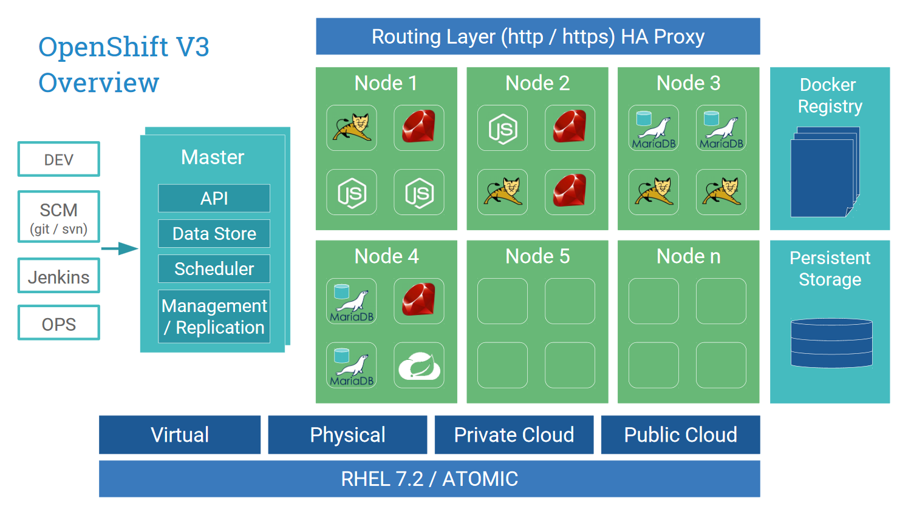

# Lab 1: Quicktour through OpenShift V3

In this lab the basic concepts of OpenShift are presented. We will also show you how to log in to the web console and briefly present the individual areas.

The terms and resources listed here are an excerpt from the official OpenShift documentation, further information about OpenShift can be found here:

> https://docs.openshift.com/container-platform/3.5/architecture/index.html

## Basic concepts

OpenShift V3 is based on modern Open Source concepts such as Docker and Kubernetes, providing a platform that can be used to build, deploy, and operate software in containers. OpenShift V3 can be called Container Platform or Platform as a Service (PaaS).

### Docker

[Docker](https://www.docker.com/) is the open platform for developers and sysadmins and their applications. Choose the base docker images that match your technology, and OpenShift automatically builds an updated Docker container after you build it, and deploy it as you want.

### Kubernetes

Orchestrate and manage containers with[Kubernetes](http://kubernetes.io/) by Google. You define how many instances of your application should run in parallel, and Kubernetes takes care of the scaling, load balancing and stability.

## Overview

### Container und Docker Images

The basic elements of OpenShift applications are docker containers. With docker containers, processes on a Linux system can be isolated so that they can only interact with the defined resources. This allows many different containers to run on the same system without seeing each other (files, processes, network). Typically, a container contains a single service (web server, database, mail service, cache). Within a Docker container, any process can be executed.

Docker containers are based on docker images. A docker image is a binary file that contains all the necessary components to run a single container.

Docker images are created by dockerfiles (textual description of how the docker image is built step by step). Basically, docker images are hierarchically applied file system snapshots.

**Tomcat Example**
- Basis Image (CentOs 7)
- + Install Java
- + Install Tomcat
- + Install App

The docker images are stored in version control in the OpenShift internal Docker Registry and are available to the platform for deployment after the build.

### Projects

In OpenShift V3, resources (containers and docker images, pods, services, routes, configuration, quotas and limits etc.) are structured in projects. From a technical point of view, a project corresponds to a Kubernetes namespace and extends these concepts with certain concepts.

Within a project, authorized users can manage and organize their own resources.

The resources within a project are linked via a transparent [SDN](https://de.wikipedia.org/wiki/Software-defined_networking). The resources within a project are linked via a transparent.

### Pods

OpenShift adopts the Concept of Pods from Kubernetes.

A pod is one or more containers that are deployed together on the same host. A pod is the smallest unit to deploy on OpenShift.

A pod is available within an OpenShift project via the appropriate service.

### Services

A service represents an internal loadbalancer on the pods behind it (replicas of the same type). The service serves as a proxy to the pods and forwards requests to them. This allows pods to be arbitrarily added to and removed from a service while the service remains available.

A service is assigned an IP and a port within a project and distributes requests accordingly to the pod replicas.

### Routen

With a route you define how a service can be accessed by external clients.

These routes are entered in the routing layer and then allow the platform to forward the requests to the relevant service via hostname mapping.

If more than one pod is deployed for a service, the routing layer distributes the requests to the deployed pods

The following protocols are currently supported:

- HTTP
- HTTPS ([SNI](https://en.wikipedia.org/wiki/Server_Name_Indication))
- WebSockets
- TLS mit [SNI](https://en.wikipedia.org/wiki/Server_Name_Indication)

### Templates

A template describes a list of resources that can be executed on OpenShift and created accordingly in OpenShift.

This way you have the possibility to describe entire infrastructures:

- Java Application Service (3 Replicas, rolling Upgrade)
- Databank Service
- Via Route https://java.app.appuio-beta.ch available on the internet

---

**End Lab 1**

<a href="02_cli.md">install OpenShift CLI →</a>

[← back to overview](../README.md)
