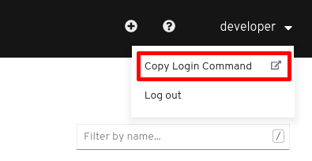

# Lab 3: Erste Schritte auf der Lab Plattform

In diesem Lab werden wir gemeinsam das erste Mal mit der Lab Plattform interagieren, dies sowohl über den `oc` Client wie auch über die Web Console.

## Login

__Note__:
Vergewissern Sie sich, dass Sie [Lab 2](02_cli.md) erfolgreich abgeschlossen haben, d.h. erfolgreich auf der Web Console einloggen sowie den `oc` Client installieren konnten.

### Befehl kopieren via Web Console

Der Befehl für das Login mit `oc` kann komfortabel via Web Console geholt werden.
Dazu oben rechts auf den eigenen Username und anschliessend auf _Copy Login Command_ klicken:



Nun kann der Befehl wie er unter "Log in with this token" dargestellt wird kopiert und in einem Terminal-Fenster eingefügt werden.

### Login direkt mit `oc`

Als Alternative zum Kopieren des Befehls kann direkt mit `oc` eingeloggt werden:

```bash
oc login FIXME: URL
```

## Projekt erstellen

Ein Projekt in OpenShift ist das Top-Level Konzept um Ihre Ressourcen wie Deployments, Builds, Container Images etc. zu organisieren.
Für das Projekt berechtigte User können diese Ressourcen verwalten.
Innerhalb eines OpenShift Clusters muss der Name eines Projektes eindeutig sein.
Siehe auch [Lab 1](01_quicktour.md).

## Aufgabe: LAB3.1

Erstellen Sie auf der Lab Plattform ein neues Projekt mit Namen `[USERNAME]-example1`.

Um herauszufinden, wie Sie ein neues Projekt mit `oc` erstellen, können Sie folgenden Befehl verwenden:

```bash
oc help
```

<details><summary><b>Tipp</b></summary>oc new-project [USERNAME]-example1</details><br/>

## Web Console

Die OpenShift Web Console erlaubt es den Benutzern gewisse Tasks direkt via Browser vorzunehmen.

## Aufgabe: LAB3.2

1. Gehen Sie in die Übersicht Ihres eben erstellten Projektes. Aktuell ist das Projekt noch leer.

1. Fügen Sie Ihre erste Applikation Ihrem Projekt hinzu. Als Beispielprojekt verwenden wir ein APPUiO Example:

   1. Wechseln Sie zuerst von der Administrator- in die Developer-Ansicht oben links

   1. Stellen Sie sicher, dass bei "Project" Ihr neu erstelltes Projekt selektiert ist.

   1. Wählen Sie nun das Feld "From Catalog"

   1. Schränken Sie die Auswahl über einen Klick auf _Languages_ und anschliessend _PHP_ ein

   1. Wählen Sie nun das Feld "PHP" aus und klicken auf "Create Application"

   1. Füllen Sie das Feld "Git Repo URL" mit folgender URL

   ```
   https://github.com/appuio/example-php-sti-helloworld.git
   ```

1. Belassen Sie die restlichen Felder leer oder auf deren Standardwert und klicken auf _Create_

Sie haben soeben Ihre erste Applikation mittels sog. __[Source to Image](https://docs.openshift.com/container-platform/4.3/builds/build-strategies.html#build-strategy-s2i_build-strategies)__ Build auf OpenShift deployed.

__Tipp__:
Mit den folgenden Befehlen kann das obere Beispiel auf der Kommandozeile erstellt werden:

```bash
oc new-app https://github.com/appuio/example-php-sti-helloworld.git
oc expose svc example-php-sti-helloworld
```

__Note__:
Der `oc new-app`-Befehl benötigt `git`.
Falls `git` nicht installiert ist, insb. auf Windows, kann das Tool [hier heruntergeladen](https://git-scm.com/download/win) und installiert werden.

__Tipp__:
Eine so erstellte Applikation mitsamt den zusätzlich angelegten Ressourcen kann mithilfe von Labels auf einen Schlag gelöscht werden, bspw. mit folgendem Befehl:

```bash
oc delete all --selector app.kubernetes.io/component=example-php-sti-helloworld-git
```

Um die Labels der verschiedenen Ressourcen anzuzeigen kann folgender Befehl verwendet werden:

```bash
oc get all --show-labels
```

---

__Ende Lab 3__

<p width="100px" align="right"><a href="04_deploy_dockerimage.md">Ein Container Image deployen →</a></p>

[← zurück zur Übersicht](../README.md)
