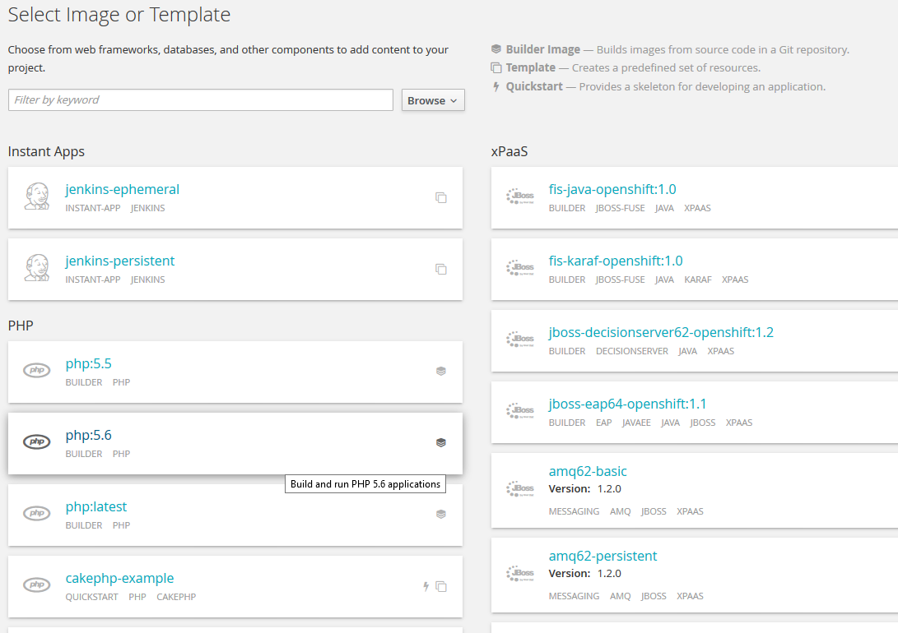
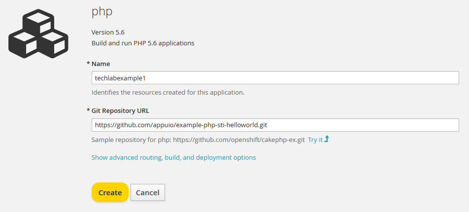
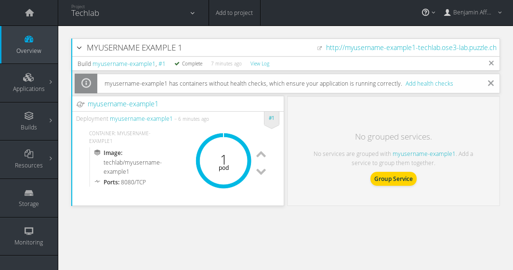

# Lab 3: Erste Schritte auf der Lab Plattform

In diesem Lab werden wir gemeinsam das erste Mal mit der Lab Plattform interagieren, dies sowohl über den oc Client wie auch über die Web Console

## Login

**Note:** Versichern Sie sich, dass Sie [Lab 2](02_cli.md) erfolgreich abgeschlossen haben.

Bitte verwenden Sie für das Login auf dem Webinterface sowie mit `oc` die durch den Instruktor zur Verfügung gestellten Angaben.


## Projekt erstellen

Ein Projekt in OpenShift ist das Top Level Konzept um Ihre Applikationen, Deployments, Builds, Container etc. zu organisieren. Siehe [Lab1](01_quicktour.md).


## Aufgabe: LAB3.1
Erstellen Sie auf der Lab Plattform ein neues Projekt.

**Note**: Verwenden Sie für Ihren Projektnamen am besten Ihren Github Namen oder Ihren Nachnamen, bspw. `[USER]-example1`

> Wie kann ein neues Projekt erstellt werden?

**Tipp** :information_source:
```
$ oc help
```

## Web Console

Die OpenShift V3 Web Console erlaubt es den Benutzern gewisse Tasks direkt via Browser vorzunehmen.

## Aufgabe: LAB3.2
1. Loggen Sie sich nun via Web Console auf der Lab Plattform ein.

  **Note:** Die **URL**, Benutzernamen und Passwort für Ihren Account wird Ihnen entsprechend am Techlab durch den Instruktor zur Verfügung gestellt.

1. Gehen Sie nun in die Übersicht Ihres eben erstellten Projektes. Aktuell ist das Projekt noch leer.

1. Fügen Sie über *Add to Project* Ihre erste Applikation Ihrem Projekt hinzu. Als Beispielprojekt verwenden wir ein APPUiO Example.

  3.1. Wählen Sie dazu das Basis Image **php 5.6** aus


  3.2. Geben Sie Ihrem Beispiel einen sprechenden Namen und folgende URL als Repo URL
  ```
  https://github.com/appuio/example-php-sti-helloworld.git
  ```


1. Die Applikation wurde erstellt. Über den Link **Go to overview** kommt man zur Übersicht.

1. Der Build Ihrer Applikation wird gestartet. Verfolgen Sie den Build und schauen Sie sich nach dem Deployment die Beispiel App an.




Sie haben nun Ihre erste Applikation mittels sogenanntem **[Source to Image](https://docs.openshift.com/container-platform/3.5/architecture/core_concepts/builds_and_image_streams.html#source-build)** Build auf OpenShift deployed.

**Tipp:** mit dem folgenden Command können Sie in ein anderes Projekt wechseln:
```
$ oc project [projectname]
```

**Tipp:** Mit den folgenden Befehlen kann das obere Beispiel aus der Kommandozeile erstellt werden:
```
$ oc new-app https://github.com/appuio/example-php-sti-helloworld.git --name=appuio-php-sti-example
$ oc expose svc appuio-php-sti-example
```

**Tipp:** eine ganze App kann mit dem folgenden Befehl gelöscht werden:
```
$ oc delete all -l app=appname
```
bspw.
```
$ oc delete all -l app=appuio-php-sti-example
```

---

## Lösung: LAB3.1

```
$ oc new-project [USER]-example1
```
---

**Ende Lab 3**

<p width="100px" align="right"><a href="04_deploy_dockerimage.md">Ein Docker Image deployen →</a></p>

[← zurück zur Übersicht](../README.md)
