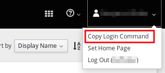

# Lab 3: Erste Schritte auf der Lab Plattform

In diesem Lab werden wir gemeinsam das erste Mal mit der Lab Plattform interagieren, dies sowohl über den oc Client wie auch über die Web Console

## Login

**Note:** Vergewissern Sie sich, dass Sie [Lab 2](02_cli.md) erfolgreich abgeschlossen haben, d.h. erfolgreich auf dem Webinterface einloggen sowie den `oc` Client installieren konnten.

Der Befehl für das Login mit `oc` kann komfortabel via Webinterface kopiert werden. Dazu oben rechts auf das Account-Symbol und anschliessend auf *Copy Login Command* klicken:



Den Befehl nun in einem Terminal-Fenster einfügen.


## Projekt erstellen

Ein Projekt in OpenShift ist das Top Level Konzept um Ihre Applikationen, Deployments, Builds, Container etc. zu organisieren. Siehe [Lab1](01_quicktour.md).


## Aufgabe: LAB3.1

Erstellen Sie auf der Lab Plattform ein neues Projekt.

**Note**: Verwenden Sie für Ihren Projektnamen am besten Ihren Techlab-Benutzernamen oder sonstigen Identifier, bspw. `[USER]-example1`

> Wie kann ein neues Projekt erstellt werden?

**Tipp** :information_source:
```
$ oc help
```


## Web Console

Die OpenShift Web Console erlaubt es den Benutzern gewisse Tasks direkt via Browser vorzunehmen.


## Aufgabe: LAB3.2

1. Gehen Sie in die Übersicht Ihres eben erstellten Projektes. Aktuell ist das Projekt noch leer.

1. Fügen Sie Ihre erste Applikation Ihrem Projekt hinzu. Als Beispielprojekt verwenden wir ein APPUiO Example:

   1. Wechseln Sie zuerst in die Catalog-Ansicht, indem Sie entweder den Button *Add to Project* oben rechts oder direkt *Browse Catalog* in der Projektübersicht wählen
 
   1. Wählen Sie den Reiter *Languages* und anschliessend *PHP* aus
 
   1. Wählen Sie dazu als Version *7.1* aus
 
   1. Geben Sie Ihrem Beispiel einen sprechenden Namen und folgende URL als Repo URL:
   ```
   https://github.com/appuio/example-php-sti-helloworld.git
   ```
   

1. Mit Klick auf *Create* wird die Applikation erstellt

1. Über den Link *Continue to the project overview* kann der Aufbau (bestehend aus Build und anschliessendem Deployment) beobachtet werden

Sie haben nun Ihre erste Applikation mittels sog. **[Source to Image](https://docs.openshift.com/container-platform/3.9/architecture/core_concepts/builds_and_image_streams.html#source-build)** Build auf OpenShift deployed.

**Tipp:** Mit dem folgenden Command können Sie in ein anderes Projekt wechseln:
```
$ oc project [projectname]
```

**Tipp:** Mit den folgenden Befehlen kann das obere Beispiel aus der Kommandozeile erstellt werden:
```
$ oc new-app https://github.com/appuio/example-php-sti-helloworld.git --name=appuio-php-sti-example
$ oc expose svc appuio-php-sti-example
```

**Tipp:** Eine ganze App kann mit dem folgenden Befehl gelöscht werden:
```
$ oc delete all --selector app=appname
```
bspw.
```
$ oc delete all --selector app=appuio-php-sti-example
```

---

## Lösung: LAB3.1

```
$ oc new-project [USER]-example1
```
---

**Ende Lab 3**

<p width="100px" align="right"><a href="04_deploy_dockerimage.md">Ein Docker Image deployen →</a></p>

[← zurück zur Übersicht](../README.md)
