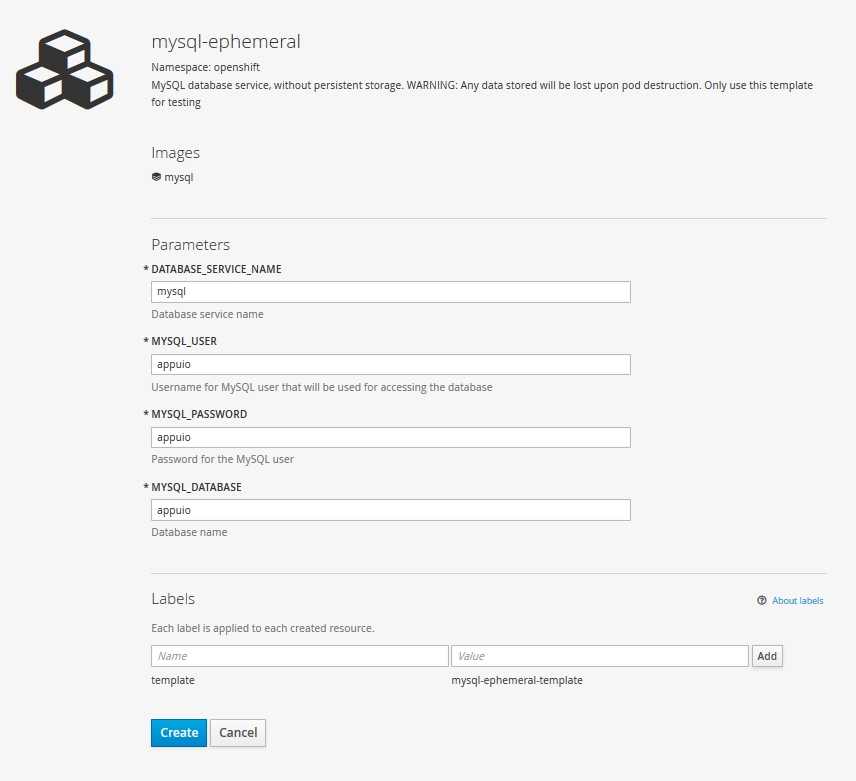

# Lab 8: Datenbank anbinden

Die meisten Applikationen sind in irgend einer Art Statefull und speichern Daten persistent ab. Sei dies in einer Datenbank oder als Files auf einem Filesystem oder Objectstore. In diesem Lab werden wir in unserem Projekt einen MySQL Service anlegen und an unsere Applikation anbinden, so dass mehrere Applikationspods auf die gleiche Datenbank zugreifen können.

## Aufgabe: LAB8.1: MySQL Service anlegen

Für unser Beispiel verwenden wir in diesem Lab ein OpenShift Template das eine MySQL Datenbank mit EmptyDir data Storage anlegt. Dies ist nur für Testumgebungen zu verwenden, da beim restarten des MySQL Pods alle Daten verloren gehen. In einem späteren Lab werden wir an die MySQL Datenbank ein persistent Volume (mysql-persistent) anhängen, damit bleiben die Daten auch bei Restarts bestehen.

Den MySQL Service können wir sowohl über die Webconsole wie auch über das CLI angelegt werden.

Datenbankname, Username, Password und DatabaseServiceName müssen lediglich bei beiden Varianten analog gesetzt werden.

- MYSQL_USER appuio
- MYSQL_PASSWORD appuio
- MYSQL_DATABASE appuio 
- DATABASE_SERVICE_NAME mysql

### CLI

Übers CLI kann der MySQL Service wie folgt angelegt werden.

```
$ oc new-app mysql-ephemeral -pMYSQL_USER=appuio -pMYSQL_PASSWORD=appuio -pMYSQL_DATABASE=appuio -pDATABASE_SERVICE_NAME=mysql
```

### WebConsole

In der WebConsole kann der MySQL Service über "Add to Project" dem Projekt hinzugefügt werden.



## Aufgabe: LAB8.2: Applikation an die Datenbank anbinden.

Standardmässig wird bei unserer example-spring-boot Applikation eine H2 Memory Datenbank verwendet. Dies kann über das setzen der folgenden Umgebungsvariablen entsprechend auf unseren neuen MySQL Service umgestellt werden.

- SPRING_DATASOURCE_USERNAME appuio
- SPRING_DATASOURCE_PASSWORD appuio
- SPRING_DATASOURCE_DRIVER_CLASS_NAME com.mysql.jdbc.Driver
- SPRING_DATASOURCE_URL jdbc:mysql://[adresse des mysql Services]/appuio

Für die Adresse des MySQL Service können wir entweder die Cluster IP des MySQL Services verwenden. **Tipp:** `oc get service`

oder aber den DNS Namen (<service>.<project>.svc.cluster.local) des MySQL Services verwenden, alle Services und Pods innerhalb eines Projektes können über DNS aufgelöst werden. 

So lautet der Wert für die Variable SPRING_DATASOURCE_URL beispielsweise:
```
Projektname = techlab-dockerimage

jdbc:mysql://mysql.techlab-dockerimage.svc.cluster.local/appuio
```

Diese Umgebungsvariablen können wir nun in der DeploymentConfig example-spring-boot setzen, nach dem ConfigChange wird die Applikation automatisch neu deployed. Auf Grund der neuen Umgebungsvariablen verbindet die Applikatoin an die MySQL DB und Liquibase kreiert das Schema und Testdaten.

```
 $ oc env dc example-spring-boot -e SPRING_DATASOURCE_USERNAME=appuio -e SPRING_DATASOURCE_PASSWORD=appuio -e SPRING_DATASOURCE_DRIVER_CLASS_NAME=com.mysql.jdbc.Driver -e SPRING_DATASOURCE_URL=jdbc:mysql://mysql.techlab-dockerimage.svc.cluster.local/appuio
```
 **Note:** Hostname des mysql Service muss auf Ihr Projekt angepasst werden
 
 Über den folgenden Befehl können Sie sich die DeploymentConfig als Json anschauen, neu enthatet die Config auf die gesetzten Umgebungsvariablen
 
```
 $ oc get dc example-spring-boot -o json
```

```
...
 "env": [
	        {
	            "name": "SPRING_DATASOURCE_USERNAME",
	            "value": "appuio"
	        },
	        {
	            "name": "SPRING_DATASOURCE_PASSWORD",
	            "value": "appuio"
	        },
	        {
	            "name": "SPRING_DATASOURCE_DRIVER_CLASS_NAME",
	            "value": "com.mysql.jdbc.Driver"
	        },
	        {
	            "name": "SPRING_DATASOURCE_URL",
	            "value": "jdbc:mysql://mysql.techlab.svc.cluster.local/appuio"
	        }
	    ],
...
```

## Aufgabe: LAB8.3: in MySQL Service Pod einloggen und manuell auf db connection

Wie im Lab [07](07_troubleshooting_ops.md) beschrieben, kann mittels `oc rsh [POD]` in einen Pod eingelogged werden.
```
$ oc get pods
NAME                           READY     STATUS             RESTARTS   AGE
example-spring-boot-8-wkros    1/1       Running            0          10m
mysql-1-diccy                  1/1       Running            0          50m

```

Danach in den MySQL Pod einloggen
```
$ oc rsh mysql-1-diccy
```

Nun können Sie mittels msql Tool die auf die Datenbank verbinden und die Tabellen anzeigen:
```
$ mysql -u$MYSQL_USER -p$MYSQL_PASSWORD -h$MYSQL_SERVICE_HOST appuio
Welcome to the MySQL monitor.  Commands end with ; or \g.
Your MySQL connection id is 54
Server version: 5.6.26 MySQL Community Server (GPL)

Copyright (c) 2000, 2015, Oracle and/or its affiliates. All rights reserved.

Oracle is a registered trademark of Oracle Corporation and/or its
affiliates. Other names may be trademarks of their respective
owners.

Type 'help;' or '\h' for help. Type '\c' to clear the current input statement.

mysql>
```

Anschliessend können sie über 
```
show tables;
```

alle Tabellen anzeigen.


## Aufgabe: LAB8.4: Dump auf MySQL DB einspielen

Die Aufgabe ist es in den MySQL Pod den [Dump](./data/08_dump/dump.sql) einzuspielen 


**Tipp:** mit `oc rsync` können Sie locale Datein in einen Pod kopieren

**Tipp:** verwenden Sie das Tool mysql um den Dump einzuspielen.

**Tipp:** Die bestehende Datenbank muss vorgängig leer sein, sie kann auch gelösch und neu angelegt werden.


---

## Lösung: LAB8.4

Ein ganzes Verzeichnis (dump) synchen, darin enthalten ist das File dump.sql 
```
oc rsync ./data/08_dump mysql-1-diccy:/tmp/
```
In den MySQL Pod einloggen

```
$ oc rsh mysql-1-diccy
```

Bestehende Datenbank löschen
```
$ mysql -u$MYSQL_USER -p$MYSQL_PASSWORD -h$MYSQL_SERVICE_HOST appuio
... 
mysql> drop database appuio;
mysql> create database appuio;
```
Dump einspielen
```
$ mysql -u$MYSQL_USER -p$MYSQL_PASSWORD -h$MYSQL_SERVICE_HOST appuio < /tmp/dump.sql
```

**Note:** Den Dump kann man wie folgt erstellen:

mysqldump --user=$MYSQL_USER --password=$MYSQL_PASSWORD --host=$MYSQL_SERVICE_HOST appuio > /tmp/dump.sql 


---

**Ende Lab 8**

[<< zurück zur Übersicht] (../README.md)

