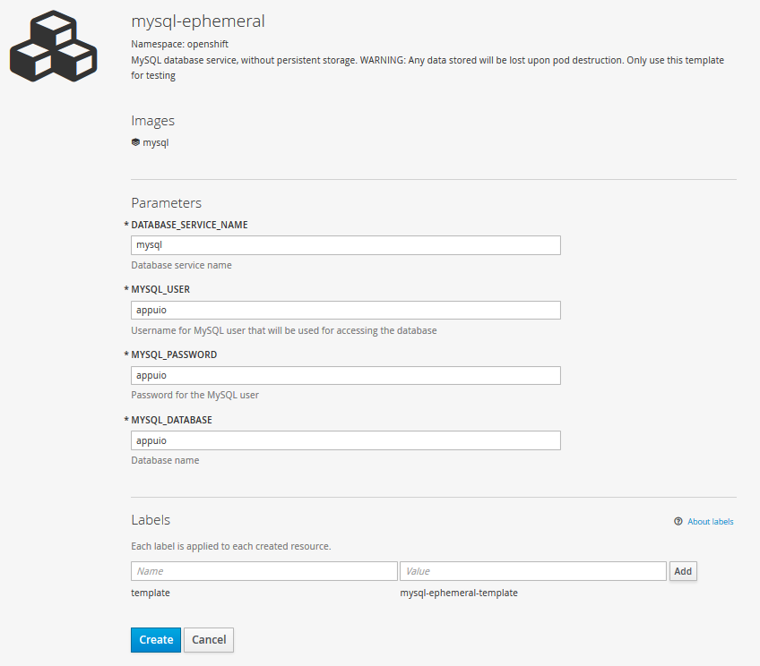

# Lab 8: Deploy and Attach a Database

There's mostly two different kinds of state when talking about stateful applications. The easier method is state that can be preserved in e.g. some kind of database, as a file or in an object store. In this lab we are going to add a MySQL service to our project and attach it so that multiple application pods can access the same database.

We're going to use our Springboot app from [lab 4](04_deploy_dockerimage.md), `[USER]-dockerimage`. **Hint:** `oc project [USER]-dockerimage`

## Task: LAB8.1: Create a MySQL service

In this lab we're going to use an OpenShift template which will create a MySQL database with ephemeral storage, meaning the database's data will not (yet) be persistent. This setup is therefore only recommended for test environments since all the data is lost if the MySQL pod is restarted. We are going to attach persistent storage to our database in a later lab.

The MySQL service can be created in the Web Console as well as with the CLI.

To get the same result one has to simply set the database name, username, password and database service name regardless of the method:

- MYSQL_USER appuio
- MYSQL_PASSWORD appuio
- MYSQL_DATABASE appuio
- DATABASE_SERVICE_NAME mysql

### CLI

Using the cli the MySQL service can be created as follows:

```
$ oc new-app mysql-ephemeral \
     -pMEMORY_LIMIT=256Mi \
     -pMYSQL_USER=appuio -pMYSQL_PASSWORD=appuio \
     -pMYSQL_DATABASE=appuio -pDATABASE_SERVICE_NAME=mysql
```

### Web Console
In the Web Console one can create the MySQL (Ephemeral) Service via "Add to Project" -> "Data Stores":



## Task: LAB8.2: Applikation an die Datenbank anbinden

By default a H2 memory database is used for our example-spring-boot application. This can be changed to our new MySQL service by setting the following environment variables:

- SPRING_DATASOURCE_USERNAME appuio
- SPRING_DATASOURCE_PASSWORD appuio
- SPRING_DATASOURCE_DRIVER_CLASS_NAME com.mysql.jdbc.Driver
- SPRING_DATASOURCE_URL jdbc:mysql://[MySQL service's address]/appuio?autoReconnect=true

As the MySQL service's address we can either use its cluster IP (`oc get service`) or its DNS name (`<service>`). All services and pods within a project can be resolved via DNS.

E.g. the value for the variable SPRING_DATASOURCE_URL is:
```
Name of the services: mysql

jdbc:mysql://mysql/appuio?autoReconnect=true
```

We can now set these environment variables in the DeploymentConfig example-spring-boot. After the **ConfigChange** (ConfigChange is registered as a trigger in the DeploymentConfig), the application is automatically deployed again. Because of the new environment variables the application connects to the MySQL DB and [Liquibase](http://www.liquibase.org/) creates the schema and imports the test data.

**Note:** Liquibase is open source. It is a database-independent library to manage and apply database changes. Liquibase recognizes when starting the application, whether database changes have to be applied to the database or not. See Logs.


```
SPRING_DATASOURCE_URL=jdbc:mysql://mysql/appuio?autoReconnect=true
```
**Note:** `mysql` resolves the cluster IP of the MySQL service within its project via DNS query. The MySQL database is only available within the project. The service is also available by the following name:

```
Project name = techlab-dockerimage

mysql.techlab-dockerimage.svc.cluster.local
```

Command for setting the environment variables:
```
 $ oc env dc example-spring-boot \
      -e SPRING_DATASOURCE_URL="jdbc:mysql://mysql/appuio?autoReconnect=true" \
      -e SPRING_DATASOURCE_USERNAME=appuio -e SPRING_DATASOURCE_PASSWORD=appuio \
      -e SPRING_DATASOURCE_DRIVER_CLASS_NAME=com.mysql.jdbc.Driver
```

You can use the following command to view the DeploymentConfig as JSON. Now the config also contains the freshly set environment variables:

```
 $ oc get dc example-spring-boot -o json
```

```
...
 "env": [
	        {
	            "name": "SPRING_DATASOURCE_USERNAME",
	            "value": "appuio"
	        },
	        {
	            "name": "SPRING_DATASOURCE_PASSWORD",
	            "value": "appuio"
	        },
	        {
	            "name": "SPRING_DATASOURCE_DRIVER_CLASS_NAME",
	            "value": "com.mysql.jdbc.Driver"
	        },
	        {
	            "name": "SPRING_DATASOURCE_URL",
	            "value": "jdbc:mysql://mysql/appuio"
	        }
	    ],
...
```

The configuration can also be viewed and changed in the web console:

(Applications → Deployments → example-spring-boot, Actions, Edit YAML)

## Task: LAB8.3: Log into MySQL Service Pod and connect to DB manually

As described in the Lab [07](07_troubleshooting_ops.md) you can log into a pod using  `oc rsh [POD]`:

```bash
$ oc get pods
NAME                           READY     STATUS             RESTARTS   AGE
example-spring-boot-8-wkros    1/1       Running            0          10m
mysql-1-diccy                  1/1       Running            0          50m

```

Then log into the MySQL Pod:

```bash
oc rsh mysql-1-diccy
```

Now you can connect to the database using mysql tool and display the tables:

```bash
$ mysql -u$MYSQL_USER -p$MYSQL_PASSWORD -h$MYSQL_SERVICE_HOST appuio
Welcome to the MySQL monitor.  Commands end with ; or \g.
Your MySQL connection id is 54
Server version: 5.6.26 MySQL Community Server (GPL)

Copyright (c) 2000, 2015, Oracle and/or its affiliates. All rights reserved.

Oracle is a registered trademark of Oracle Corporation and/or its
affiliates. Other names may be trademarks of their respective
owners.

Type 'help;' or '\h' for help. Type '\c' to clear the current input statement.

mysql>
```

Then you can use

```mysql
show tables;
```

Display all tables.

## Task: LAB8.4: Import dump to MySQL DB

The task is to put the [dump](https://raw.githubusercontent.com/appuio/techlab/lab-3.3/labs/data/08_dump/dump.sql) into the MySQL database.


**Hint:** Use `oc rsync` to copy local files to a pod.

**Attention:** Note that the rsync command of the operating system is used. On UNIX systems, rsync can be installed with the package manager, on Windows, for example, [cwRsync](https://www.itefix.net/cwrsync). If an installation of rsync is not possible, you can, for example, log into the pod and download the dump via `curl -O <URL>`.

**Hint:** Use the mysql tool to load the dump.

**Hint:** The existing database must be empty beforehand. It can also be deleted and re-created.

---

## Solution: LAB8.4

Sync an entire directory (dump). This includes the file `dump.sql`. Note for the rsync-command the hint above aswell the missing trailing slash.

```bash
oc rsync ./labs/data/08_dump mysql-1-diccy:/tmp/
```

Log in to the MySQL Pod:

```bash
oc rsh mysql-1-diccy
```

Delete the existing Database:

```bash
$ mysql -u$MYSQL_USER -p$MYSQL_PASSWORD -h$MYSQL_SERVICE_HOST appuio
...
mysql> drop database appuio;
mysql> create database appuio;
mysql> exit
```

Insert dump:

```bash
mysql -u$MYSQL_USER -p$MYSQL_PASSWORD -h$MYSQL_SERVICE_HOST appuio < /tmp/08_dump/dump.sql
```

**Note:** he dump can be created as follows:

```bash
mysqldump --user=$MYSQL_USER --password=$MYSQL_PASSWORD --host=$MYSQL_SERVICE_HOST appuio > /tmp/dump.sql
```

---

**Ende Lab 8**

<p width="100px" align="right"><a href="09_dockerbuild_webhook.md">Code Änderungen via Webhook direkt integrieren →</a></p>

[← back to overview](../README.md)
