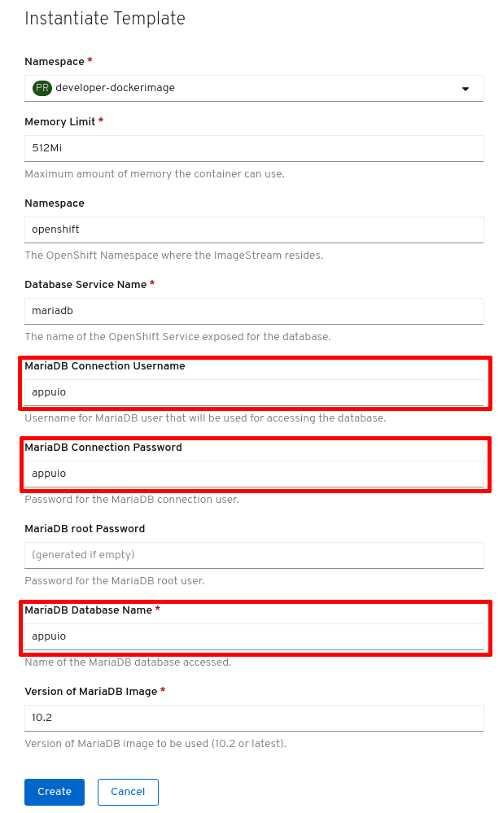

# Lab 8: Datenbank anbinden

Die meisten Applikationen sind in irgend einer Art stateful (sie haben also einen eigenen Zustand) und speichern Daten persistent ab.
Sei dies in einer Datenbank oder als Files auf einem Filesystem oder Objectstore.
In diesem Lab werden wir in unserem Projekt einen MariaDB-Service anlegen und an unsere Applikation anbinden, sodass mehrere Applikationspods auf die gleiche Datenbank zugreifen können.

Für dieses Beispiel verwenden wir das Spring Boot-Beispiel aus [Lab 4](04_deploy_dockerimage.md), `[USERNAME]-dockerimage`.

<details><summary><b>Tipp</b></summary>oc project [USERNAME]-dockerimage</details><br/>

## Aufgabe: LAB8.1: MariaDB Service anlegen

Für unser Beispiel verwenden wir in diesem Lab ein OpenShift Template, welches eine MariaDB Datenbank mit EmptyDir Data Storage anlegt.
Dies ist nur für Testumgebungen zu verwenden, da beim Restart des MariaDB Pod alle Daten verloren gehen.
In einem späteren Lab werden wir aufzeigen, wie wir ein Persistent Volume (mariadb-persistent) an die MariaDB Datenbank anhängen.
Damit bleiben die Daten auch bei Restarts bestehen, womit der Setup auch für den produktiven Betrieb geeignet ist.

Den MariaDB Service können wir sowohl über die Web Console als auch über das CLI anlegen.

Um dasselbe Ergebnis zu erhalten müssen lediglich Datenbankname, Username, Password und DatabaseServiceName gleich gesetzt werden, egal welche Variante verwendet wird:

- `MYSQL_USER: appuio`
- `MYSQL_PASSWORD: appuio`
- `MYSQL_DATABASE: appuio`
- `DATABASE_SERVICE_NAME: mariadb`

### CLI

Über das CLI kann der MariaDB Service wie folgt angelegt werden.

__Note__:
Die Backslashes (`\`) dienen dazu, einen langen Befehl übersichtlicher auf mehreren Zeilen abzubilden.
__Auf Windows__ ist der sog. Multiline Delimiter aber nicht der Backslash, sondern in cmd das Caret (`^`) und in PowerShell der Backtick (`` ` ``).

```bash
oc new-app mariadb-ephemeral \
   -pMYSQL_USER=appuio \
   -pMYSQL_PASSWORD=appuio \
   -pMYSQL_DATABASE=appuio
```

Diese Ressourcen werden angelegt:

```bash
secret/mariadb created
service/mariadb created
deploymentconfig.apps.openshift.io/mariadb created
```

### Web Console

In der Web Console kann der MariaDB (Ephemeral) Service via Catalog in der Developer-Ansicht dem Projekt hinzugefügt werden:

- Zuerst sicherstellen, dass oben links von der Administrator- auf die Developer-Ansicht gewechselt wurde
- Auf "\+Add" klicken
- "From Catalog" wählen
- Auswahl mit Klick auf "Databases", "MariaDB" einschränken
- Das Feld "MariaDB (Ephemeral)" und anschliessend "Instantiate Template" auswählen
- Die Formularfelder "MariaDB Connection Username", "MariaDB Connection Password" sowie "MariaDB Database Name" abfüllen
- Die restlichen Formularfelder leer oder auf deren Standardwert belassen und mit "Create" erstellen lassen



### Passwort und Username als Plaintext?

Beim Deployen der Datenbank via CLI wie auch via Web Console haben wir mittels Parameter Werte für User, Passwort und Datenbank angegeben.
In diesem Kapitel wollen wir uns nun anschauen, wo diese sensitiven Daten effektiv gelandet sind.

Schauen wir uns als erstes die DeploymentConfig der Datenbank an:

```bash
oc get dc mariadb -o yaml
```

Konkret geht es um die Konfiguration der Container mittels Umgebungsvariablen (`MYSQL_USER`, `MYSQL_PASSWORD`, `MYSQL_ROOT_PASSWORD`, `MYSQL_DATABASE`) in der DeploymentConfig unter `spec.templates.spec.containers`:

```yaml
spec:
  containers:
    - env:
        - name: MYSQL_USER
          valueFrom:
            secretKeyRef:
              key: database-user
              name: mariadb
        - name: MYSQL_PASSWORD
          valueFrom:
            secretKeyRef:
              key: database-password
              name: mariadb
        - name: MYSQL_ROOT_PASSWORD
          valueFrom:
            secretKeyRef:
              key: database-root-password
              name: mariadb
        - name: MYSQL_DATABASE
          valueFrom:
            secretKeyRef:
              key: database-name
              name: mariadb
```

Die Werte für die einzelnen Umgebungsvariablen kommen also aus einem sogenannten Secret, in unserem Fall hier aus dem Secret mit Namen `mariadb`.
In diesem Secret sind die vier Werte unter den passenden Keys (`database-user`, `database-password`, `database-root-password`, `database-name`) abgelegt und können so referenziert werden.

Schauen wir uns nun die neue Ressource Secret mit dem Namen `mariadb` an:

```bash
oc get secret mariadb -o yaml
```

Die Key-Value Pairs sind unter `data` ersichtlich:

```yaml
apiVersion: v1
data:
  database-name: YXBwdWlv
  database-password: YXBwdWlv
  database-root-password: dDB3ZDFLRFhsVjhKMGFHQw==
  database-user: YXBwdWlv
kind: Secret
metadata:
  annotations:
    openshift.io/generated-by: OpenShiftNewApp
    template.openshift.io/expose-database_name: '{.data[''database-name'']}'
    template.openshift.io/expose-password: '{.data[''database-password'']}'
    template.openshift.io/expose-root_password: '{.data[''database-root-password'']}'
    template.openshift.io/expose-username: '{.data[''database-user'']}'
  creationTimestamp: 2018-12-04T10:33:43Z
  labels:
    app: mariadb-ephemeral
    template: mariadb-ephemeral-template
  name: mariadb
  ...
type: Opaque
```

Die konkreten Werte sind base64-kodiert.
Unter Linux oder in der Git Bash kann man sich den Wert einfach mittels:

```bash
echo "YXBwdWlv" | base64 -d
appuio
```

anzeigen lassen.
In unserem Fall wird `YXBwdWlv` in `appuio` dekodiert.

Alternativ kann mit dem Befehl `oc extract secret/mariadb` der Inhalt jedes einzelnen Keys in ein eigenes File geschrieben werden.
Mit dem Parameter `--to=[DIRECTORY]` kann das Verzeichnis definiert werden, in welches die Werte geschrieben werden soll.
Ohne Angabe dieses Parameters wird das aktuelle Verzeichnis verwendet.

Mit Secrets können wir also sensitive Informationen (Credentials, Zertifikate, Schlüssel, dockercfg, ...) ablegen und so von den Pods entkoppeln.
Gleichzeitig haben wir damit die Möglichkeit, dieselben Secrets in mehreren Containern zu verwenden und so Redundanzen zu vermeiden.

Secrets können entweder, wie oben bei der MariaDB-Datenbank, in Umgebungsvariablen gemappt oder direkt als Files via Volumes in einen Container gemountet werden.

Weitere Informationen zu Secrets können in der [offiziellen Dokumentation](https://docs.openshift.com/container-platform/4.2/nodes/pods/nodes-pods-secrets.html) gefunden werden.

## Aufgabe: LAB8.2: Applikation an die Datenbank anbinden

Standardmässig wird bei unserer example-spring-boot Applikation eine H2 Memory Datenbank verwendet.
Dies kann über das Setzen der folgenden Umgebungsvariablen entsprechend auf unseren neuen MariaDB Service umgestellt werden:

- `SPRING_DATASOURCE_USERNAME: appuio`
- `SPRING_DATASOURCE_PASSWORD: appuio`
- `SPRING_DATASOURCE_DRIVER_CLASS_NAME: com.mysql.jdbc.Driver`
- `SPRING_DATASOURCE_URL: jdbc:mysql://[Adresse des MariaDB Service]/appuio?autoReconnect=true`

Für die Adresse des MariaDB Service können wir entweder dessen Cluster IP (`oc get service`) oder aber dessen DNS-Namen (`<service>`) verwenden.
Alle Services und Pods innerhalb eines Projektes können über DNS aufgelöst werden.

So lautet der Wert für die Variable `SPRING_DATASOURCE_URL` bspw.:

```
Name des Service: mariadb

jdbc:mysql://mariadb/appuio?autoReconnect=true
```

Diese Umgebungsvariablen können wir nun in der DeploymentConfig example-spring-boot setzen.
Nach dem __ConfigChange__ wird die Applikation automatisch neu deployed (ConfigChange ist in der DeploymentConfig als Trigger registriert).
Aufgrund der neuen Umgebungsvariablen verbindet die Applikation an die MariaDB DB und [Liquibase](http://www.liquibase.org/) kreiert das Schema und importiert die Testdaten.

__Note__:
Liquibase ist Open Source.
Es ist eine datenbank-unabhängige Library, um Datenbankänderungen zu verwalten und anzuwenden.
Liquibase erkennt beim Startup der Applikation, ob DB Changes auf der Datenbank angewendet werden müssen oder nicht.
Siehe Logs.

```bash
SPRING_DATASOURCE_URL=jdbc:mysql://mariadb/appuio?autoReconnect=true
```

__Note__:
MariaDB löst innerhalb Ihres Projektes via DNS-Abfrage auf die Cluster IP des MariaDB Service auf.
Die MariaDB Datenbank ist nur innerhalb des Projektes erreichbar.
Der Service ist ebenfalls über den folgenden Namen erreichbar:

```
Projektname = techlab-dockerimage

mariadb.techlab-dockerimage.svc.cluster.local
```

Über das CLI kann der MariaDB Service wie folgt angelegt werden:

__Note__:
Die Backslashes (`\`) dienen dazu, den langen Befehl übersichtlicher auf mehreren Zeilen abzubilden.
__Auf Windows__ ist der sog. Multiline Delimiter aber nicht der Backslash, sondern in cmd das Caret (`^`) und in PowerShell der Backtick (`` ` ``).

```bash
oc set env dc example-spring-boot \
    -e SPRING_DATASOURCE_URL="jdbc:mysql://mariadb/appuio?autoReconnect=true" \
    -e SPRING_DATASOURCE_USERNAME=appuio \
    -e SPRING_DATASOURCE_PASSWORD=appuio \
    -e SPRING_DATASOURCE_DRIVER_CLASS_NAME=com.mysql.jdbc.Driver
```

Durch die Änderung des Environments wird automatisch ein Deployment der example-spring-boot Applikation angestossen.
Dabei wir der Pod bzw. Container mit der neuen Umgebung gestartet.

Über den folgenden Befehl können Sie sich die DeploymentConfig in json anschauen.
Neu enthält die Config auch die gesetzten Umgebungsvariablen:

```bash
oc get dc example-spring-boot -o json
```

```json
...
"env": [
    {
        "name": "SPRING_DATASOURCE_URL",
        "value": "jdbc:mysql://mariadb/appuio?autoReconnect=true&useSSL=false"
    },
    {
        "name": "SPRING_DATASOURCE_USERNAME",
        "value": "appuio"
    },
    {
        "name": "SPRING_DATASOURCE_PASSWORD",
        "value": "appuio"
    },
    {
        "name": "SPRING_DATASOURCE_DRIVER_CLASS_NAME",
        "value": "com.mysql.jdbc.Driver"
    }
],
...
```

Die Konfiguration kann auch in der Web Console angeschaut und verändert werden:

- Stellen Sie sicher, dass Sie sich in der Developer-Ansicht (Auswahl oben links) befinden
- Klicken Sie auf Topology
- Wählen Sie die example-spring-boot DC aus, indem Sie auf das OpenShift-Symbol klicken
- Im neu geöffneten Seitenfenster wählen Sie oben rechts unter "Actions" die Option "Edit DeploymentConfig"

### Spring Boot Applikation

Öffnen Sie die Applikation im Browser.

Sind die "Say Hello" Einträge von früher noch da?

- Wenn ja, wieso?
- Wenn nein, wieso?

Fügen Sie ein paar neue "Say Hello" Einträge ein.

## Aufgabe: LAB8.2.1: Secret referenzieren

Weiter oben haben wir gesehen, wie OpenShift mittels Secrets sensitive Informationen von der eigentlichen Konfiguration entkoppelt und uns dabei hilft, Redundanzen zu vermeiden.
Unsere Springboot Applikation aus dem vorherigen Lab haben wir zwar korrekt konfiguriert, allerings aber die Werte redundant und Plaintext in der DeploymentConfig abgelegt.

Passen wir nun die DeploymentConfig example-spring-boot so an, dass die Werte aus den Secrets verwendet werden.
Zu beachten gibt es die Konfiguration der Container unter `spec.template.spec.containers`.

Mittels `oc edit dc example-spring-boot -o json` kann die DeploymentConfig im JSON-Format wie folgt bearbeitet werden.

```json
...
"env": [
    {
        "name": "SPRING_DATASOURCE_USERNAME",
        "valueFrom": {
            "secretKeyRef": {
                "key": "database-user",
                "name": "mariadb"
            }
        }
    },
    {
        "name": "SPRING_DATASOURCE_PASSWORD",
        "valueFrom": {
            "secretKeyRef": {
                "key": "database-password",
                "name": "mariadb"
            }
        }
    },
    {
        "name": "SPRING_DATASOURCE_DRIVER_CLASS_NAME",
        "value": "com.mysql.jdbc.Driver"
    },
    {
        "name": "SPRING_DATASOURCE_URL",
        "value": "jdbc:mysql://mariadb/appuio?autoReconnect=true"
    }
],
...
```

Nun werden die Werte für Username und Passwort sowohl beim MariaDB-Pod wie auch beim Springboot-Pod aus dem selben Secret gelesen.

### Spring Boot Applikation

Öffnen Sie die Applikation im Browser.

Sind die "Say Hello" Einträge von früher noch da?

- Wenn ja, wieso?
- Wenn nein, wieso?

Fügen Sie ein paar neue "Say Hello" Einträge ein.

## Aufgabe: LAB8.3: In MariaDB Service Pod einloggen und manuell auf DB verbinden

Wie im Lab [07](07_troubleshooting_ops.md) beschrieben kann mittels `oc rsh [POD]` in einen Pod eingeloggt werden:

```bash
$ oc get pods
NAME                           READY     STATUS             RESTARTS   AGE
example-spring-boot-8-wkros    1/1       Running            0          10m
mariadb-1-diccy                  1/1       Running            0          50m
```

Danach in den MariaDB Pod einloggen:

```bash
oc rsh mariadb-1-diccy
```

Einfacher ist, es den Pod über die DeploymentConfig zu referenzieren.

```bash
oc rsh dc/mariadb
```

Nun können Sie mittels mysql-Tool auf die Datenbank verbinden:

```bash
mysql -u$MYSQL_USER -p$MYSQL_PASSWORD -h$MARIADB_SERVICE_HOST $MYSQL_DATABASE
```

Und mit:

```sql
show tables;
```

alle Tabellen anzeigen.

Was enthält die hello-Tabelle?

<details><summary><b>Tipp</b></summary>select * from hello;</details><br/>

## Aufgabe: LAB8.4: Dump auf MariaDB DB einspielen

Die Aufgabe ist es, in den MariaDB Pod den [Dump](https://raw.githubusercontent.com/appuio/techlab/lab-3.3/labs/data/08_dump/dump.sql) einzuspielen.

__Tipp__:
Mit `oc rsync` oder `oc cp` können Sie lokale Dateien in einen Pod kopieren.
Alternativ kann auch curl im MariaDB-Container verwendet werden.

__Achtung__:
Beachten Sie, dass dabei der rsync-Befehl des Betriebssystems verwendet wird.
Auf UNIX-Systemen kann rsync mit dem Paketmanager, auf Windows kann bspw. [cwRsync](https://www.itefix.net/cwrsync) installiert werden.
Ist eine Installation von rsync nicht möglich, kann stattdessen bspw. in den Pod eingeloggt und via `curl -O <URL>` der Dump heruntergeladen werden.

__Tipp__:
Verwenden Sie das Tool mysql um den Dump einzuspielen.

__Tipp__:
Die bestehende Datenbank muss vorgängig leer sein.
Sie kann auch gelöscht und neu angelegt werden.

### Spring Boot Applikation

Öffnen Sie die Applikation im Browser.

Sind die "Say Hello" Einträge von früher noch da?

- Wenn ja, wieso?
- Wenn nein, wieso?

---

## Lösung: LAB8.4

Ein ganzes Verzeichnis (dump) syncen.
Darin enthalten ist das File `dump.sql`.
Beachten Sie zum rsync-Befehl auch obenstehenden Tipp sowie den fehlenden "trailing slash".

```bash
oc rsync ./labs/data/08_dump mariadb-1-diccy:/tmp/
```

In den MariaDB-Pod einloggen:

```bash
oc rsh dc/mariadb
```

Bestehende Datenbank löschen:

```bash
mysql -u$MYSQL_USER -p$MYSQL_PASSWORD -h$MARIADB_SERVICE_HOST $MYSQL_DATABASE
...
mysql> drop database appuio;
mysql> create database appuio;
mysql> exit
```

Dump einspielen:

```bash
mysql -u$MYSQL_USER -p$MYSQL_PASSWORD -h$MARIADB_SERVICE_HOST $MYSQL_DATABASE < /tmp/08_dump/dump.sql
```

Was enthält die hello Tabelle jetzt?

<details><summary><b>Tipp</b></summary>mysql -u$MYSQL_USER -p$MYSQL_PASSWORD -h$MARIADB_SERVICE_HOST $MYSQL_DATABASE<br/>mysql> select * from hello;</details><br/>

__Note__:
Den Dump kann man wie folgt erstellen:

```bash
mysqldump -u$MYSQL_USER -p$MYSQL_PASSWORD -h$MARIADB_SERVICE_HOST $MYSQL_DATABASE > /tmp/dump.sql
```

---

__Ende Lab 8__

<p width="100px" align="right"><a href="09_dockerbuild_webhook.md">Code Änderungen via Webhook direkt integrieren →</a></p>

[← zurück zur Übersicht](../README.md)
