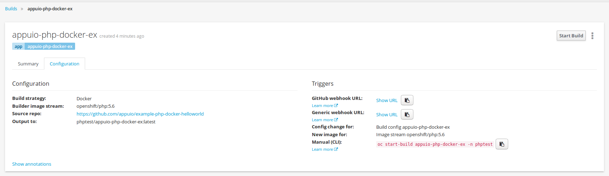
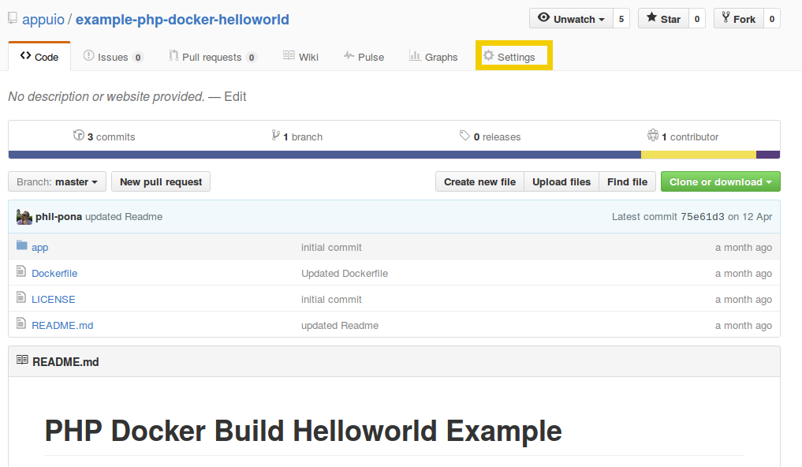
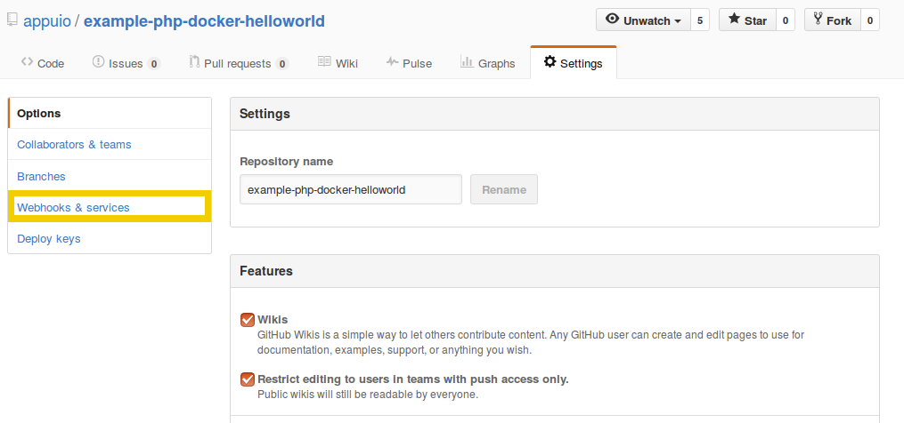
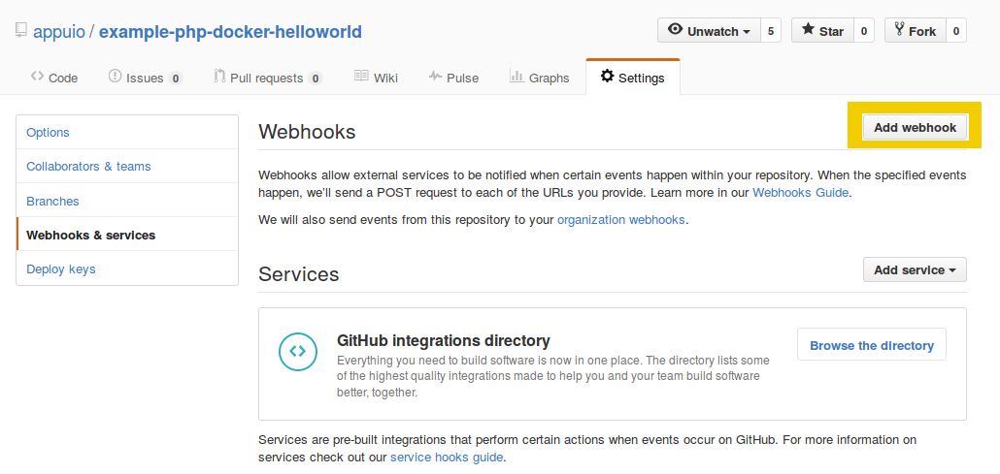
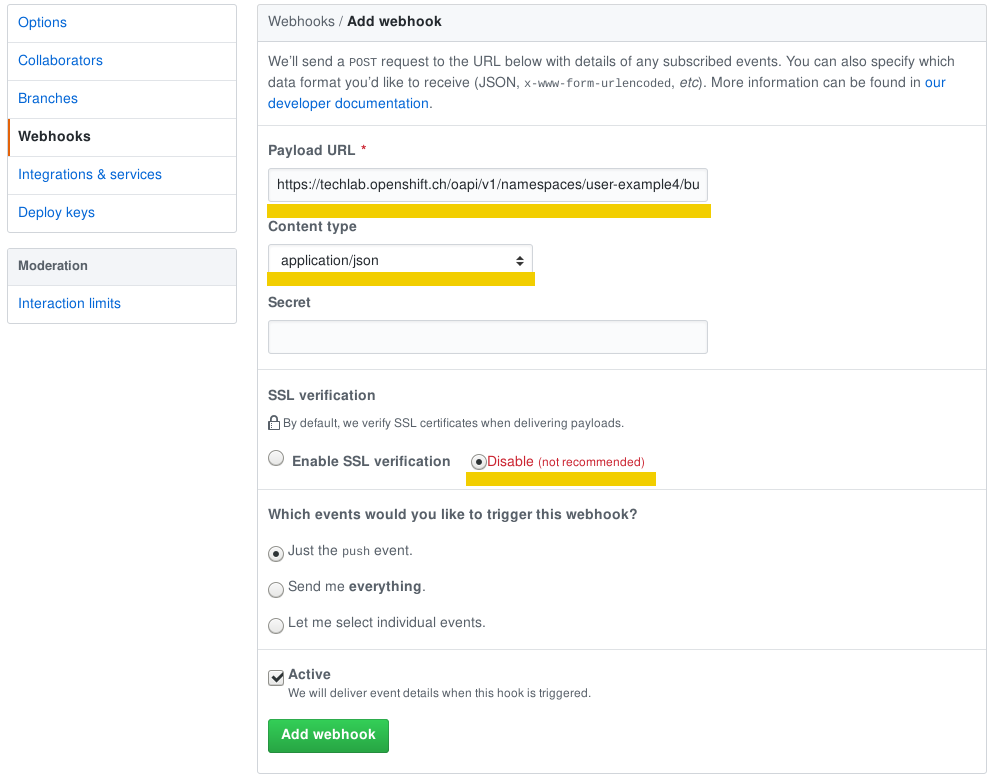
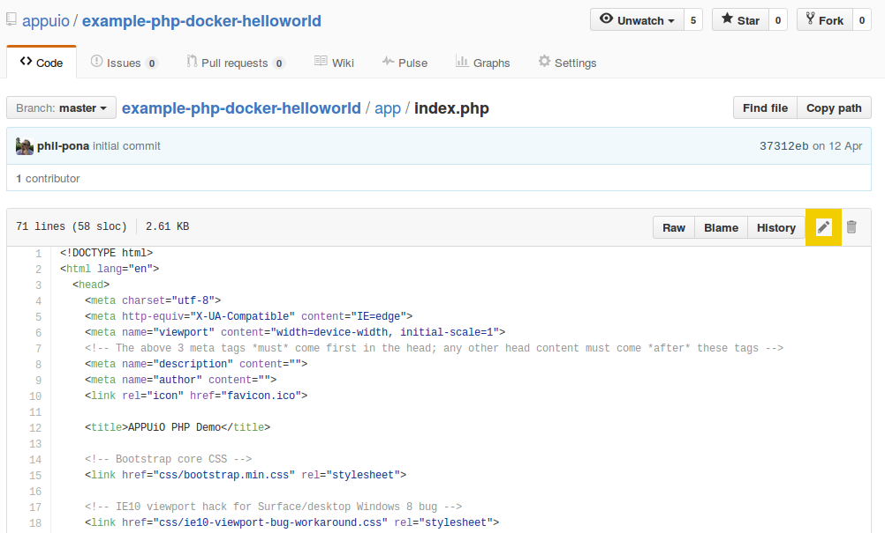

# Lab 9: Code Changes durch Webhook triggern Rebuild auf OpenShift

In diesem Lab zeigen wir den Docker Build Workflow anhand eines Beispiels auf und Sie lernen, wie Sie mit einem Push in das Git Repository einen Build und ein Deployment der Applikation auf OpenShift starten.

## Aufgabe: LAB9.1: Vorbereitung Github Account und Fork

### Github Account

Damit Sie Änderungen am Source Code unserer Beispielapplikation vornehmen können, benötigen Sie einen eigenen GitHub Account. Richten Sie sich einen Account unter https://github.com/ ein, falls Sie nicht bereits über einen verfügen.

### Beispiel-Projekt forken

**Beispiel-Projekt:** https://github.com/appuio/example-php-docker-helloworld

Gehen Sie auf die [GitHub Projekt-Seite](https://github.com/appuio/example-php-docker-helloworld) und [forken](https://help.github.com/articles/fork-a-repo/) Sie das Projekt.


Sie haben nun unter
```
https://github.com/[YourGitHubUser]/example-php-docker-helloworld
```

einen Fork des Example Projektes, den Sie so erweitern können wie Sie wollen.

## Deployen des eigenen Forks

Erstellen Sie ein neues Projekt:
```
$ oc new-project [USER]-example4
```

Erstellen Sie für Ihren Fork eine neue App. **Note:** Ersetzen Sie `[YourGithubUser]` mit dem Namen Ihres GitHub Accounts:

```
$ oc new-app https://github.com/[YourGithubUser]/example-php-docker-helloworld.git --strategy=docker --name=appuio-php-docker-ex
```
Mittels Parameter `--strategy=docker` sagen wir dem `oc new-app` Befehl nun explizit, er soll im angegebenen Git Repository nach einem Dockerfile suchen und dieses für den Build verwenden.

Nun exponieren Sie den Service mit:
```
$ oc expose service appuio-php-docker-ex
```

## Aufgabe: LAB9.2: Webhook auf GitHub einrichten

Beim Erstellen der App wurden in der BuildConfig (bc) direkt Webhooks definiert. Diese Webhooks können Sie von der Web Console kopieren. Gehen Sie dafür via Builds → Builds auf den entsprechenden Build und wählen Sie das Tab Configuration aus:



Kopieren Sie die GitHub [Webhook](https://developer.github.com/webhooks/) URL und fügen Sie sie auf GitHub entsprechend ein.

Klicken Sie in Ihrem Projekt auf Settings:


Klicken Sie auf Webhooks & services:


Fügen Sie einen Webhook hinzu:


Fügen Sie die entsprechende GitHub Webhook URL aus Ihrem OpenShift Projekt ein:


Ab jetzt triggern alle Pushes auf Ihrem GitHub Repository einen Build und deployen anschliessend die Code-Änderungen direkt auf die OpenShift-Plattform.

## Aufgabe: LAB9.3: Code anpassen

Klonen Sie Ihr Git Repository und wechseln Sie in das Code Verzeichnis:
```
$ git clone https://github.com/[YourGithubUser]/example-php-docker-helloworld.git
$ cd example-php-docker-helloworld
```

Passen Sie das File bspw. auf Zeile 56 ./app/index.php an:
```
$ vim app/index.php
```


```
    <div class="container">

      <div class="starter-template">
        <h1>Hallo <?php echo 'OpenShift Techlab'?></h1>
        <p class="lead">APPUiO Example Dockerfile PHP</p>
      </div>

    </div>
```

Pushen Sie Ihren Change:
```
$ git add .
$ git commit -m "updated Hello"
$ git push
```

Als Alternative können Sie das File auch direkt auf GitHub editieren:


Sobald Sie die Änderungen gepushed haben, startet OpenShift einen Build des neuen Source Code
```
$ oc get builds
```

und deployed anschliessend die Änderung.

## Aufgabe: LAB9.4: Rollback

Mit OpenShift lassen sich unterschiedliche Software-Stände aktivieren und deaktivieren, indem einfach eine andere Version des Images gestartet wird.

Dafür werden die Befehle `oc rollback` und `oc rollout` verwendet.

Um ein Rollback auszuführen, brauchen Sie den Namen der DeploymentConfig:

```
$ oc get dc

NAME                   REVISION   DESIRED   CURRENT   TRIGGERED BY
appuio-php-docker-ex   4          1         1         config,image(appuio-php-docker-ex:latest)

```

Mit dem folgenden Befehl können Sie nun ein Rollback auf die Vorgänger-Version ausführen:

```
$ oc rollback appuio-php-docker-ex
#3 rolled back to appuio-php-docker-ex-1
Warning: the following images triggers were disabled: appuio-php-docker-ex:latest
  You can re-enable them with: oc set triggers dc/appuio-php-docker-ex --auto
```

Sobald das Deployment der alten Version erfolgt ist, können Sie über Ihren Browser überprüfen, ob wieder die ursprüngliche Überschrift **Hello APPUiO** angezeigt wird.

**Tipp:** Die automatischen Deployments neuer Versionen ist nun für diese Applikation ausgeschaltet um ungewollte Änderungen nach dem Rollback zu verhindern. Um das automatische Deployment wieder einzuschalten führen Sie den folgenden Befehl aus:


```
$ oc set triggers dc/appuio-php-docker-ex --auto
```

---

**Ende Lab 9**

<p width="100px" align="right"><a href="10_persistent_storage.md">Persistent Storage anbinden und verwenden für Datenbank →</a></p>

[← zurück zur Übersicht](../README.md)
