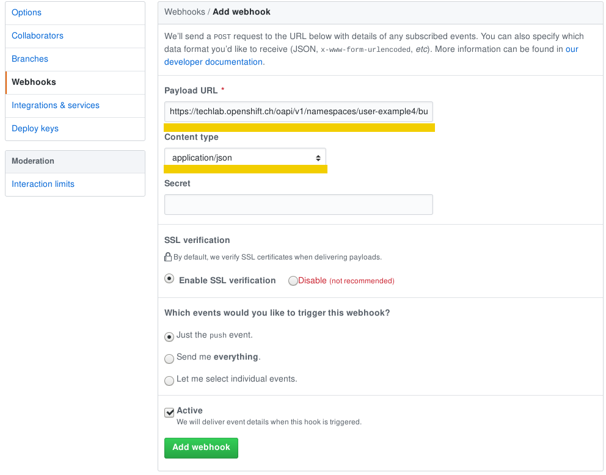

# Lab 11: Code Changes durch Webhook triggern Rebuild auf OpenShift

In diesem Lab zeigen wir den Docker Build Workflow anhand eines Beispiels auf und Sie lernen, wie Sie mit einem Push in das Git Repository automatisch einen Build und ein Deployment der Applikation auf OpenShift starten.


## Aufgabe 1: Vorbereitung Github Account und Fork
### Github Account

Damit Sie Änderungen am Source Code unserer Beispielapplikation vornehmen können, benötigen Sie einen eigenen GitHub Account.
Richten Sie sich einen Account unter <https://github.com/> ein, falls Sie nicht bereits über einen verfügen.


### Beispiel-Projekt forken

__Beispiel-Projekt__: <https://github.com/appuio/example-php-docker-helloworld>

Gehen Sie auf die [GitHub Projekt-Seite](https://github.com/appuio/example-php-docker-helloworld) und [forken](https://help.github.com/articles/fork-a-repo/) Sie das Projekt.


Sie haben nun unter `https://github.com/[YourGitHubUser]/example-php-docker-helloworld` einen Fork des Example Projektes, den Sie so erweitern können wie Sie wollen.


## Deployen des eigenen Forks

Erstellen Sie ein neues Projekt mit Namen `[USERNAME]-example4`.

<details><summary><b>Tipp</b></summary>oc new-project [USERNAME]-example4</details><br/>

Erstellen Sie für Ihren Fork eine neue App mit folgender Konfiguration:

* Name: `appuio-php-docker-ex`
* Build Strategie: `docker`
* Git Repository: `https://github.com/[YourGithubUser]/example-php-docker-helloworld.git`

__Note__:
Ersetzen Sie `[YourGithubUser]` mit dem Namen Ihres GitHub Accounts.

<details>
  <summary>Applikation Erstellen Befehl</summary>
  oc new-app https://github.com/[YourGithubUser]/example-php-docker-helloworld.git --strategy=docker --name=appuio-php-docker-ex
</details><br/>

Mittels Parameter `--strategy=docker` sagen wir dem `oc new-app` Befehl nun explizit, er soll im angegebenen Git Repository nach einem Dockerfile suchen und dieses für den Build verwenden.

Nun exponieren Sie den Service der Applikation.

<details><summary>Route Erstellen Befehl</summary>oc create route edge --service=appuio-php-docker-ex</details><br/>


## Aufgabe 2: Webhook auf GitHub einrichten

Beim Erstellen der App wurden in der BuildConfig (bc) direkt Webhooks definiert.
Diese Webhooks können Sie von der Web Console kopieren.
Gehen Sie dafür via Menüpunkt "Builds" auf den "appuio-php-docker-ex" Build.
Sie sehen nun die Webhooks auf der Seite unten.


Kopieren Sie die [GitHub Webhook URL](https://developer.github.com/webhooks/) mit einem Klick rechts auf "Copy URL with Secret".

Klicken Sie in Ihrem GitHub-Projekt auf Settings:


Klicken Sie auf Webhooks:


Fügen Sie einen Webhook hinzu:


Fügen Sie nun die kopierte GitHub Webhook URL ein:


Ab jetzt triggern alle Pushes auf Ihrem GitHub Repository einen Build und deployen anschliessend die Code-Änderungen direkt auf die OpenShift-Plattform.


## Aufgabe 3: Code anpassen

Klonen Sie Ihr Git Repository und wechseln Sie in das Code Verzeichnis:

```bash
git clone https://github.com/[YourGithubUser]/example-php-docker-helloworld.git
cd example-php-docker-helloworld
```

Passen Sie das File `./app/index.php` bspw. auf Zeile 56 an:

```bash
vim app/index.php
```


```html
    <div class="container">

      <div class="starter-template">
        <h1>Hallo <?php echo 'OpenShift Techlab'?></h1>
        <p class="lead">APPUiO Example Dockerfile PHP</p>
      </div>

    </div>
```

Pushen Sie Ihren Change:

```bash
git add .
git commit -m "Update hello message"
git push
```

Als Alternative können Sie das File auch direkt auf GitHub editieren:


Sobald Sie die Änderungen gepushed haben, startet OpenShift einen Build des neuen Source Code.

```bash
oc get builds
```

und deployed anschliessend die Änderungen.

## Aufgabe 4: Rollback

Mit OpenShift lassen sich unterschiedliche Software-Stände aktivieren und deaktivieren, indem einfach eine andere Version des Image gestartet wird.

Dafür werden die Befehle `oc rollback` und `oc rollout` verwendet.

Um ein Rollback auszuführen, brauchen Sie den Namen der DeploymentConfig:

```bash
oc get dc

NAME                   REVISION   DESIRED   CURRENT   TRIGGERED BY
appuio-php-docker-ex   4          1         1         config,image(appuio-php-docker-ex:latest)
```

Mit dem folgenden Befehl können Sie nun ein Rollback auf die Vorgänger-Version ausführen:

```bash
oc rollback appuio-php-docker-ex
#3 rolled back to appuio-php-docker-ex-1
Warning: the following images triggers were disabled: appuio-php-docker-ex:latest
  You can re-enable them with: oc set triggers dc/appuio-php-docker-ex --auto
```

Sobald das Deployment der alten Version erfolgt ist, können Sie über Ihren Browser überprüfen, ob wieder die ursprüngliche Überschrift __Hello APPUiO__ angezeigt wird.

__Tipp__:
Automatische Deployments neuer Versionen sind nun für diese Applikation deaktiviert, um ungewollte Änderungen nach dem Rollback zu verhindern. Um das automatische Deployment wieder zu aktivieren, führen Sie den folgenden Befehl aus:

```bash
oc set triggers dc/appuio-php-docker-ex --auto
```

---

__Ende Lab 11__

<p width="100px" align="right"><a href="12_template.md">Applikationstemplates →</a></p>

[← zurück zur Übersicht](../README.md)
